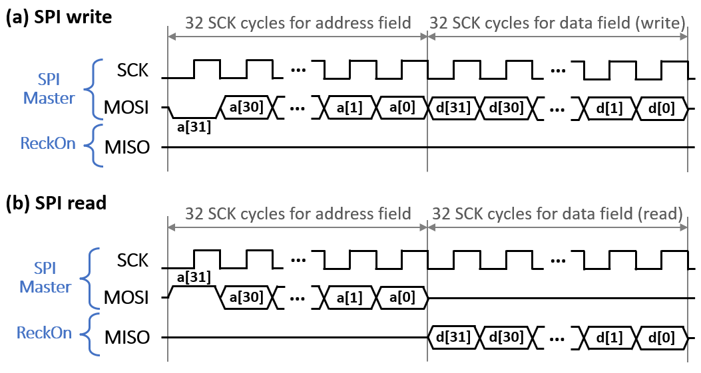
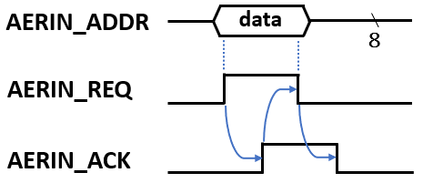

# ReckOn Online-Learning Spiking RNN Processor Documentation

> Copyright (C) 2020-2022 University of Zurich

> The documentation for ReckOn is under a Creative Commons Attribution 4.0 International License (see [doc/LICENSE](LICENSE) file or http://creativecommons.org/licenses/by/4.0/), while the ReckOn HDL source code is under a Solderpad Hardware License v2.1 (see [LICENSE](../LICENSE) file or https://solderpad.org/licenses/SHL-2.1/).

> 

Before reading the documentation, it is strongly advised to read our [*ISSCC 2022* paper](#6-citing-reckon) in order to have a clear overview of the ReckOn online-learning spiking RNN processor.

Part of the documentation structure, formatting and contents is adapted from the documentation of the [ODIN SNN processor](https://github.com/ChFrenkel/ODIN/).

**Current documentation revision: v1.0.** It only contains basic descriptions on the chip communication buses, memory addressing schemes and main configuration registers. Unpublished parts of the chip have been removed from the currently-released HDL code, as well as from the documentation. A documentation and HDL update will take place upon publication of the omitted parts.

## Contents

 1. [Architecture](#1-architecture)
 2. [Interfaces and commands](#2-interfaces-and-commands)
 3. [Global configuration registers](#3-global-configuration-registers)
 4. [Testbench](#4-testbench)
 5. [Implementation tips](#5-implementation-tips)
 6. [Citing ReckOn](#6-citing-reckon)
 7. [Revision history](#7-revision-history)

## 1. Architecture

ReckOn is a spiking **rec**urrent neural network (RNN) processor enabling **on**-chip learning over second-long timescales based on a modified version of the e-prop algorithm (we released a PyTorch implementation of the vanilla e-prop algorithm for leaky integrate-and-fire neurons [here](https://github.com/ChFrenkel/eprop-PyTorch)). It was prototyped and measured in 28-nm FDSOI CMOS at the Institute of Neuroinformatics, University of Zurich and ETH Zurich, and published at the 2022 *IEEE International Solid-State Circuits Conference (ISSCC)* with the following three main claims:

* ReckOn demonstrates **end-to-end on-chip learning over second-long timescales** while keeping a milli-second temporal resolution,
* it provides a low-cost solution with a 0.45-mm² core area, 5.3pJ/SOP at 0.5V, and a **memory overhead of only 0.8%** compared to the equivalent inference-only network,
* it exploits a **spike-based representation for task-agnostic learning** toward user customization and chip repurposing at the edge.

ReckOn implements a (256)-r256-16 network topology with 256 virtual input neurons, 256 recurrent leaky integrate-and-fire (LIF) neurons with all-to-all connectivity and 16 output leaky integrator (LI) neurons. A future revision of the documentation will extensively cover architectural details of ReckOn, including the embedded FSMs. For the time being, we briefly describe hereunder how the main SRAM resources of ReckOn are accessed. We refer the reader to [the paper](#6-citing-reckon) for more information on the network architecture, as well as for block diagrams of the complete system and of the e-prop-based learning scheme.

* **Neuron SRAM:** This 2-kB SRAM contains 128 words of 128 bits. Each word contains the individual state data of two neurons (i.e. current membrane potential and eligibility trace values) and their shared parameters (i.e. leakage decay factor *alpha* and firing threshold) as follows:

| Word bit range | Description (N represents the 7-bit word address)                                                           |
|----------------|------------------------------------------------------------------------|
| <127:116>      | 12 LSBs of the fractional part of the 16-bit leakage decay factor *alpha* (see [Section 3](#3-global-configuration-registers) for the 4 MSBs). Shared parameter between neurons 2N and 2N+1. |
| <115:100>      | 16-bit firing threshold. Shared parameter between neurons 2N and 2N+1. |
| <99:90>        | 10-bit output eligibility trace associated to neuron 2N+1.             |
| <89:78>        | 12-bit recurrent eligibility trace associated to neuron 2N+1.          |
| <77:66>        | 12-bit input eligibility trace associated to neuron 2N+1.              |
| <65:50>        | 16-bit membrane potential associated to neuron 2N+1.                   |
| <49:40>        | 10-bit output eligibility trace associated to neuron 2N.               |
| <39:28>        | 12-bit recurrent eligibility trace associated to neuron 2N.            |
| <27:16>        | 12-bit input eligibility trace associated to neuron 2N.                |
| <15:0>         | 16-bit membrane potential associated to neuron 2N.                     |

* **Input/recurrent weight SRAMs:** These 64-kB SRAMs contain 4k words of 128 bits for the storage of 8-bit input/recurrent weights. The 8 MSBs of the 12-bit word address contain the pre-synaptic neuron index, the 4 LSBs of the 12-bit word address contain the 4 MSBs of the post-synaptic neuron index. The 4 LSBs of the post-synaptic neuron index represent the byte address of the target weight in the accessed 128-bit word.

* **Output weight SRAM:** This 8-kB SRAM contains 512 words of 128 bits for the storage of 8-bit output weights. Only the first 256 words are used, the MSB of the 9-bit word address is thus fixed to 0 and the 8 LSBs represent the pre-synaptic neuron index. The accessed 128-bit word thus contains the output weights of all 16 output neurons.

## 2. Interfaces and commands

The top-level file [reckon.v](../src/reckon.v) contains three main interfaces: the SPI bus ([Section 2.1](#21-spi-bus)), the input AER bus ([Section 2.2](#22-address-event-representation-aer-input-bus)) and an output bus ([Section 2.3](#23-output-bus)). Other I/O pins are described as follows:

| Pin                 | Direction | Description                                                          |
|---------------------|-----------|----------------------------------------------------------------------|
|*CLK\_EXT*           | Input     | External clock.                                                      |
|*CLK\_INT_EN*        | Input     | Enable signal for the internal clock generator.                      |
|*RST*                | Input     | Global reset signal.                                                 |
|*SAMPLE*             | Input     | Signals the start and the end of an input data sample.               |
|*TIME\_TICK*         | Input     | Signals the start of a new timestep (rising edge).                   |
|*TARGET\_VALID*      | Input     | Signals timesteps for which a target is expected for e-prop updates. |
|*INFER\_ACC*         | Input     | Signals timesteps for which counts of the winning output neurons are to be updated (for classification tasks, over the course of timesteps during which *INFER\_ACC* was enabled, the label of the output neuron with the highest output over most timesteps will represent the network inference). |
|*SPI\_RDY*           | Output    | [For debug/monitoring purposes] Signals when the global FSM enters the *CONFIG* state, during which the network state is frozen and can be safely read/written through SPI. |
|*TIMING\_ERROR\_RDY* | Output    | If *SPI\_TIMING\_MODE*=1, signals the occurrence of a timing error (*TIME\_TICK* was asserted before the global FSM finished processing the current timestep). If *SPI\_TIMING\_MODE*=0, signals when the global FSM finished processing the current timestep and *TIME\_TICK* can be safely asserted. |

### 2.1. SPI bus

|  |
|:--:|
| *Fig. 1 - 32-bit SPI timing diagram for (a) write and (b) read operations.* |

ReckOn implements a standard 32-bit SPI slave bus with the following interface:

| Pin    | Direction | Width | Description                            |
|--------|-----------|-------|----------------------------------------|
|*SCK*   | Input     | 1-bit | SPI clock generated by the SPI master. |
|*MOSI*  | Input     | 1-bit | Master output, slave input.            |
|*MISO*  | Output    | 1-bit | Master input, slave output. As the fabricated chip was pad-limited, other signals can be displayed on the *MISO* pin (see [Section 3](#3-global-configuration-registers)). |

When using the SPI bus, the *SPI\_EN\_CONF* configuration register should be asserted first ([Section 3](#3-global-configuration-registers)). In order to ensure proper operation, the SCK SPI clock should operate at a frequency at least 4x smaller than the clock frequency of ReckOn. The SPI write and read operations follow the timing diagram shown in Figs. 1(a) and 1(b), respectively: a 32-bit address field is first transmitted by the SPI master, before data associated to this address is sent by the master (write) or received from ReckOn (read). Depending on the contents of the 32-bit address field *a*, where *a<31>* indicates whether a write (0) or read (1) operation should be pursued, the SPI bus can be used to access the [configuration registers](#3-global-configuration-registers) or the on-chip SRAM / register file contents as follows:

| *code<2:0>*  (*a<30:28>*) | *addr<15:0>*  (*a<15:0>*)                   | Description                                                             |
|---------------------------|---------------------------------------------|-------------------------------------------------------------------------|
| 3'b000                    | {*addr\_conf<15:0>*}                        | Write to configuration register at address *addr\_conf* (not readable). |
| 3'b001                    | {n/a,*addr\_word<6:0>*,*addr\_32b<1:0>*}    | Read/write to the neuron SRAM (128 128-bit words). 4-byte chunk *addr\_32b* from word address *addr\_word* of the SRAM is read/written. |
| 3'b010                    | {n/a,*addr\_oneur<3:0>*}                    | Read/write to the 16-bit membrane potential of output neuron *addr\_oneur* (register-file-based storage). |
| 3'b011                    | {n/a,*addr\_word<11:0>*,*addr\_32b<1:0>*}   | Read/write to the input weight SRAM (4096 128-bit words). 4-byte chunk *addr\_32b* from word address *addr\_word* of the SRAM is read/written. |
| 3'b100                    | {n/a,*addr\_word<11:0>*,*addr\_32b<1:0>*}   | Read/write to the recurrent weight SRAM (4096 128-bit words). 4-byte chunk *addr\_32b* from word address *addr\_word* of the SRAM is read/written. |
| 3'b101                    | {n/a,*addr\_word<8:0>*,*addr\_32b<1:0>*}    | Read/write to the output weight SRAM (512 128-bit words, of which only the first 256 words are used). 4-byte chunk *addr\_32b* from word address *addr\_word* of the SRAM is read/written. |

In order to accelerate initialization/readback of the ReckOn SRAMs, grouped data read/write operations can be performed over SPI from a single address field. To do so, *a<27:16>* contains the number of SPI data transactions to be performed from a starting address of *a<15:0>*, which will then be incremented internally in the SPI module. If *a<27:16>* is given a value of 1, a standard SPI transaction with a single data field is performed.

### 2.2. Address-event representation (AER) input bus

|  |
|:--:|
| *Fig. 2 - Input AER four-phase handshake timing diagram.* |

Address-event representation (AER) buses follow a four-phase-handshake protocol for asynchronous communication between neuromorphic chips. As ReckOn follows a synchronous digital IC design flow, a double-latching barrier is placed on the *REQ* line of the input AER bus in order to limit metastability issues. 

The input AER bus has the following interface:

| Pin             | Direction | Width | Description                     |
|-----------------|-----------|-------|---------------------------------|
| *AERIN\_ADDR*   | Input     | 8-bit | AER address field.              |
| *AERIN\_TAR_EN* | Input     | 1-bit | Indicates whether data in *AERIN\_ADDR* represents the address of a virtual input neuron (0) or target data for e-prop-based learning (1). |
| *AERIN\_REQ*    | Input     | 1-bit | AER request handshake line.     |
| *AERIN\_ACK*    | Output    | 1-bit | AER acknowledge handshake line. |

### 2.3. Output bus

The output bus interface has been simplified compared to the one in the fabricated chip in order to remove unpublished blocks.
The output bus in the currently-released version of the HDL has a format similar to the AER interface described in [Section 2.2](#22-address-event-representation-aer-input-bus) and its sole purpose is to transmit inference results.

| Pin            | Direction | Width  | Description                     |
|----------------|-----------|--------|---------------------------------|
| *OUT\_DATA*    | Output    | 8-bit  | Data field.                     |
| *OUT\_REQ*     | Output    | 1-bit  | Request handshake line.         |
| *OUT\_ACK*     | Input     | 1-bit  | Acknowledge handshake line.     |

For classification setups (see [Section 3](#3-global-configuration-registers) for the associated configuration registers), only one transaction takes place at the end of the sample and the 4 LSBs of *OUT\_DATA* contain the index of the output neuron with the highest output averaged over the timesteps during which the *INFER\_ACC* pin was asserted. For regression setups, a series of output transactions takes place at each timestep, where the 16-bit membrane potential values of active output neurons are successively transmitted (the 8 LSBs first, followed by the 8 MSBs).

## 3. Global configuration registers

Configuration registers can be written through the SPI bus (no readback operation is available) and are defined as follows:

| Register Name             |Addr<15:0>| Width   | Reset value | Description                     | 
|---------------------------|----------|---------|-------------|---------------------------------|
|*SPI\_EN\_CONF*            | 0        | 1-bit   | 1'b1        | Enables access to the network internal state through SPI and ensures the control FSM goes into a safe state to do so, which will be signalled through the *SPI\_RDY* pin. |
|*SPI\_RO\_STAGE\_SEL*      | 1        | 9-bit   | /           | Selects the stage of the ring-oscillator-based local clock generator (not used in the released HDL code as technology-specific blocks, incl. clock gen and frequency divider, were removed). |
|*SPI\_GET\_CLKINT\_OUT*    | 2        | 1-bit   | 1'b0        | Enables a frequency-divided copy of the locally generated clock to be displayed on the SPI *MISO* pin for monitoring purposes (not used in the released HDL code as technology-specific blocks, incl. clock gen and frequency divider, were removed). |
|*SPI\_GET\_TAR\_REQ\_OUT*  | 3        | 1-bit   | 1'b1        | Enables the target request signal to be displayed on the *MISO* pin. |
|*SPI\_RST\_MODE*           | 8        | 1-bit   | 1'b0        | Selects the spike reset mode of LIF neurons (1: reset to zero, 0: reset by subtraction). |
|*SPI\_DO\_EPROP*           | 9        | 3-bit   | 3'b111      | Enables e-prop updates (bit 0: input weight updates, bit 1: recurrent weight updates, bit 2: output weight updates). Input/recurrent/output weights can be independently configured in any plastic/frozen configuration. |
|*SPI\_LOCAL\_TICK*         | 10       | 1-bit   | 1'b0        | Enables local generation of timestep ticks (see *SPI\_CYCLES\_PER\_TICK* for the timestep duration). If configured to 0, timestep ticks are provided externally through the *TIME\_TICK* pin. |
|*SPI\_ERROR\_HALT*         | 11       | 1-bit   | 1'b1        | Enables halting the network operation if a timing error takes place (i.e. a timestep tick occurred before the global FSM finished processing the current timestep) for debugging purposes. A network reset will be necessary. |
|*SPI\_FP\_LOC\_WINP*       | 12       | 3-bit   | 3'd0        | Input weight scaling parameter. The stored 8-bit input weights are sign-extended to 16 bits and left-shifted by the value of *SPI\_FP\_LOC\_WINP* before being added to the neuron membrane potentials. |
|*SPI\_FP\_LOC\_WREC*       | 13       | 3-bit   | 3'd0        | Recurrent weight scaling parameter. The stored 8-bit recurrent weights are sign-extended to 16 bits and left-shifted by the value of *SPI\_FP\_LOC\_WREC* before being added to the neuron membrane potentials. |
|*SPI\_FP\_LOC\_WOUT*       | 14       | 3-bit   | 3'd0        | Output weight scaling parameter. The stored 8-bit output weights are sign-extended to 16 bits and left-shifted by the value of *SPI\_FP\_LOC\_WOUT* before being added to the neuron membrane potentials. |
|*SPI\_FP\_LOC\_TINP*       | 15       | 3-bit   | 3'd0        | Radix point location of input traces (left-shifted by the value of *SPI\_FP\_LOC\_TINP*). |
|*SPI\_FP\_LOC\_TREC*       | 16       | 3-bit   | 3'd0        | Radix point location of recurrent traces (left-shifted by the value of *SPI\_FP\_LOC\_TREC*). |
|*SPI\_FP\_LOC\_TOUT*       | 17       | 3-bit   | 3'd0        | Radix point location of output traces (left-shifted by the value of *SPI\_FP\_LOC\_TOUT*). |
|*SPI\_LEARN\_SIG\_SCALE*   | 18       | 4-bit   | 4'd0        | Learning signals scaling parameter, which are left-shifted by the value of *SPI\_LEARN\_SIG\_SCALE*. |
|*SPI\_REGUL\_MODE*         | 19       | 3-bit   | 3'b000      | Selects the weight regularization mode (bit 0: multiplicative regularization, bit 1: additive regularization). If bit 2 is asserted, regularization is enabled during all timesteps, not only when the *TARGET\_VALID* pin is asserted (for use only with additive regularization). |
|*SPI\_REGUL\_W*            | 20       | 2-bit   | 2'b00       | Enables weight regularization (bit 0: input weights, bit 1: recurrent weights). Input/recurrent weights can be independently configured in any regularized/non-regularized configuration. | |
|*SPI\_EN\_STOCH\_ROUND*    | 21       | 1-bit   | 1'b0        | Enables stochastic rounding in the eligibility traces and neuron membrane potentials. |
|*SPI\_SRAM\_SPEEDMODE*     | 22       | 8-bit   | 8'h00       | Configuration of the SRAM macro speed modes (not used in the released HDL code as technology-specific blocks were removed). |
|*SPI\_TIMING_MODE*         | 23       | 1-bit   | 1'b0        | Controls the pin function of *TIMING\_ERROR\_RDY* (see pin description in [Section 2](#2-interfaces-and-commands)). |
|*SPI\_REGRESSION*          | 25       | 1-bit   | 1'b0        | Should be programmed to 1 for regression tasks and 0 for classification tasks. |
|*SPI\_SINGLE\_LABEL*       | 26       | 1-bit   | 1'b1        | Should be programmed to 1 for classification tasks in order to provide the classification label only once per sample, instead of at every timestep. |
|*SPI\_NO\_OUT\_ACT*        | 27       | 1-bit   | 1'b0        | Disables the hard-sigmoid non-linearity applied to the membrane potential of output neurons. |
|*SPI\_SEND\_PER\_TIMESTEP* | 30       | 1-bit   | 1'b0        | Enables sending the network output (format conditioned by *SPI\_SEND\_LABEL\_ONLY*) at every timestep instead of once at the end of the sample. Typically for use in regression tasks. |
|*SPI\_SEND\_LABEL\_ONLY*   | 31       | 1-bit   | 1'b1        | Configures the network output contents sent over the output bus (1: winning neuron label, 0: membrane potential values of all enabled output neurons). Typically configured to 1 for classification tasks and 0 for regression tasks. |
|*SPI\_NOISE\_EN*           | 32       | 1-bit   | 1'b0        | Enables the addition of random noise to membrane potential updates of LIF neurons (noise magnitude configured with *SPI\_NOISE\_STR*). |
|*SPI\_FORCE\_TRACES*       | 33       | 1-bit   | 1'b0        | Forces eligibility trace computation even if e-prop updates are disabled (for monitoring purposes). |
|*SPI\_CYCLES\_PER\_TICK*   | 64       | 32-bit  | /           | Number of clock cycles per locally generated timestep tick (used only if *SPI\_LOCAL\_TICK* is enabled). |
|*SPI\_ALPHA\_CONF*         | 65-68    | 128-bit | 128'h0      | Each bit of *SPI\_ALPHA\_CONF* selects the 4 MSBs of the 16-bit leakage decay factors *alpha* associated to every pair of two LIF neurons, which consist of a single-bit integer part and a 15-bit fractional part (1: the integer part bit is 1 and the three MSBs of the fractional part are 3'b000, 0: the integer part bit is 0 and the three MSBs of the fractional part are 3'b111). The 12 LSBs of *alpha*'s for every pair of two LIF neurons are defined in the neuron memory ([Section 1](#1-architecture)). |
|*SPI\_KAPPA*               | 69       | 8-bit   | 8'h7A       | Defines the value of the 8-bit leakage factor *kappa* shared among all output LI neurons, which consists of a single-bit integer part and a 7-bit fractional part. |
|*SPI\_THR\_H\_0*           | 70       | 16-bit  | /           | Defines the membrane potential threshold separating the first and second segments of the straight-through-estimator (STE) function. |
|*SPI\_THR\_H\_1*           | 71       | 16-bit  | /           | Defines the membrane potential threshold separating the second and third segments of the straight-through-estimator (STE) function. |
|*SPI\_THR\_H\_2*           | 72       | 16-bit  | /           | Defines the membrane potential threshold separating the third and fourth segments of the straight-through-estimator (STE) function. |
|*SPI\_THR\_H\_3*           | 73       | 16-bit  | /           | Defines the membrane potential threshold separating the fourth and fifth segments of the straight-through-estimator (STE) function. |
|*SPI\_H\_0*                | 74       | 5-bit   | /           | Defines the value of the first segment of the straight-through-estimator (STE) function. |
|*SPI\_H\_1*                | 75       | 5-bit   | /           | Defines the value of the second segment of the straight-through-estimator (STE) function. |
|*SPI\_H\_2*                | 76       | 5-bit   | /           | Defines the value of the third segment of the straight-through-estimator (STE) function. |
|*SPI\_H\_3*                | 77       | 5-bit   | /           | Defines the value of the fourth segment of the straight-through-estimator (STE) function. |
|*SPI\_H\_4*                | 78       | 5-bit   | /           | Defines the value of the fifth segment of the straight-through-estimator (STE) function. |
|*SPI\_LR\_R\_WINP*         | 79       | 5-bit   | /           | Input weight update probability scaling parameter (applies a right shift by the value of *SPI\_LR\_R\_WINP*). |
|*SPI\_LR\_P\_WINP*         | 80       | 5-bit   | /           | Input weight update probability scaling parameter (applies a left shift by the value of *SPI\_LR\_P\_WINP*). |
|*SPI\_LR\_R\_WREC*         | 81       | 5-bit   | /           | Recurrent weight update probability scaling parameter (applies a right shift by the value of *SPI\_LR\_R\_WREC*). |
|*SPI\_LR\_P\_WREC*         | 82       | 5-bit   | /           | Recurrent weight update probability scaling parameter (applies a left shift by the value of *SPI\_LR\_P\_WREC*). |
|*SPI\_LR\_R\_WOUT*         | 83       | 5-bit   | /           | Output weight update probability scaling parameter (applies a right shift by the value of *SPI\_LR\_R\_WOUT*). |
|*SPI\_LR\_P\_WOUT*         | 84       | 5-bit   | /           | Output weight update probability scaling parameter (applies a left shift by the value of *SPI\_LR\_P\_WOUT*). |
|*SPI\_SEED\_INP*           | 85       | 25-bit  | /           | Seed of the unfolded LFSR generating random numbers for stochastic input weight updates. |
|*SPI\_SEED\_REC*           | 86       | 25-bit  | /           | Seed of the unfolded LFSR generating random numbers for stochastic recurrent weight updates. |
|*SPI\_SEED\_OUT*           | 87       | 22-bit  | /           | Seed of the unfolded LFSR generating random numbers for stochastic output weight updates. |
|*SPI\_SEED\_STRND\_NEUR*   | 88       | 30-bit  | /           | Seed of the unfolded LFSR generating random numbers for stochastic rounding of the LIF neuron membrane potentials. |
|*SPI\_SEED\_STRND\_ONEUR*  | 89       | 15-bit  | /           | Seed of the unfolded LFSR generating random numbers for stochastic rounding of the output neuron membrane potentials. |
|*SPI\_SEED\_STRND\_TINP*   | 90       | 30-bit  | /           | Seed of the unfolded LFSR generating random numbers for stochastic rounding of the input eligibility traces. |
|*SPI\_SEED\_STRND\_TREC*   | 91       | 30-bit  | /           | Seed of the unfolded LFSR generating random numbers for stochastic rounding of the recurrent eligibility traces. |
|*SPI\_SEED\_STRND\_TOUT*   | 92       | 30-bit  | /           | Seed of the unfolded LFSR generating random numbers for stochastic rounding of the output eligibility traces. |
|*SPI\_SEED\_NOISE\_NEUR*   | 93       | 17-bit  | /           | Seed of the unfolded LFSR generating random numbers for the configurable amount of noise added to the LIF neuron membrane potentials. |
|*SPI\_NUM\_INP\_NEUR*      | 94       | 8-bit   | 8'hFF       | Number of input neurons enabled in the network (should be configured to the target number of neurons -1). |
|*SPI\_NUM\_REC\_NEUR*      | 95       | 8-bit   | 8'hFF       | Number of recurrent neurons enabled in the network (should be configured to the target number of neurons -1). |
|*SPI\_NUM\_OUT\_NEUR*      | 96       | 4-bit   | 4'hF        | Number of output neurons enabled in the network (should be configured to the target number of neurons -1). |
|*SPI\_REGUL\_F0*           | 98       | 12-bit  | /           | Value of the post-synaptic recurrent eligibility traces above which regularization on the pre-synaptic weights is turned on. |
|*SPI\_REGUL\_K\_INP\_R*    | 99       | 5-bit   | /           | Input weight additive regularization scaling parameter (applies a right shift by the value of *SPI\_REGUL\_K\_INP\_R*). |
|*SPI\_REGUL\_K\_INP\_P*    | 100      | 5-bit   | /           | Input weight additive regularization scaling parameter (applies a left shift by the value of *SPI\_REGUL\_K\_INP\_P*). |
|*SPI\_REGUL\_K\_REC\_R*    | 101      | 5-bit   | /           | Recurrent weight additive regularization scaling parameter (applies a right shift by the value of *SPI\_REGUL\_K\_REC\_R*). |
|*SPI\_REGUL\_K\_REC\_P*    | 102      | 5-bit   | /           | Recurrent weight additive regularization scaling parameter (applies a left shift by the value of *SPI\_REGUL\_K\_REC\_P*). |
|*SPI\_REGUL\_K\_MUL*       | 103      | 5-bit   | /           | Input and recurrent weight multiplicative regularization scaling parameter (applies a right shift by the value of *SPI\_REGUL\_K\_MUL*). |
|*SPI\_NOISE\_STR*          | 104      | 4-bit   | /           | Neuron noise scaling parameter. Noise is generated as pseudo-random 16-bit words to be added to the LIF neuron membrane potentials, right-shifted by the value of *SPI\_NOISE\_STR*. |

## 4. Testbench

A simple testbench file demonstrating online learning is provided (see [testbench.sv](../src/tbench.sv) file, you may want to update paths listed in lines 33-37). The [data](../src/data/) folder contains two single 50-sample batches ([one for training](../src/data/dataset_cueAcc_train.dat), [one for test](../src/data/dataset_cueAcc_test.dat)) of the delayed-supervision navigation task, whose size and complexity are suitable for RTL simulations (see [paper](#6-citing-reckon) for details). The first line of these dataset files indicates the number of samples, the subsequent lines represent events: the first tuple element contains the input neuron index, the second one the time in milliseconds. Special events are used to represent the end of the sample (the first element has index -1) and the start of the delayed supervision (the first element has index -2, the second represents the target label). Random [input](../src/data/init_rand_weights_inp_cueAcc.dat), [recurrent](../src/data/init_rand_weights_rec_cueAcc.dat) and [output](../src/data/init_rand_weights_out_cueAcc.dat) weight initialization files are provided as well.

## 5. Implementation tips

When implementing ReckOn or adapting it for a particular application, care should be taken with the following points:

* The provided Verilog HDL code can directly be used for behavioral simulation. For implementation with a specific technology node, the behavioral descriptions of the neuron and weight SRAMs in [srnn.v](../src/srnn.v) need to be replaced with SRAM macros. Block RAM (BRAM) instances can be used for FPGA implementations.

* The different Verilog modules contain as parameters N and M, where N represents the number of neurons in the input and recurrent layers and M is log2(N). These parameters help rescaling ReckOn to different network dimensions, however the datapath is not entirely generic in N and M and further adaptations are needed if the dimensions are changed.

## 6. Citing ReckOn

Upon usage of the documentation or source code, please cite the paper associated to ReckOn:

> [C. Frenkel and G. Indiveri, "ReckOn: A 28nm sub-mm² task-agnostic spiking recurrent neural network processor enabling on-chip learning over second-long timescales," *IEEE International Solid-State Circuits Conference (ISSCC)*, 2022]

## 7. Revision history

| Rev    | Date         | Author     | Description                           |
|--------|--------------|------------|---------------------------------------|
|  1.0   | 18 Feb. 2022 | C. Frenkel | Basic doc without unpublished parts   |

